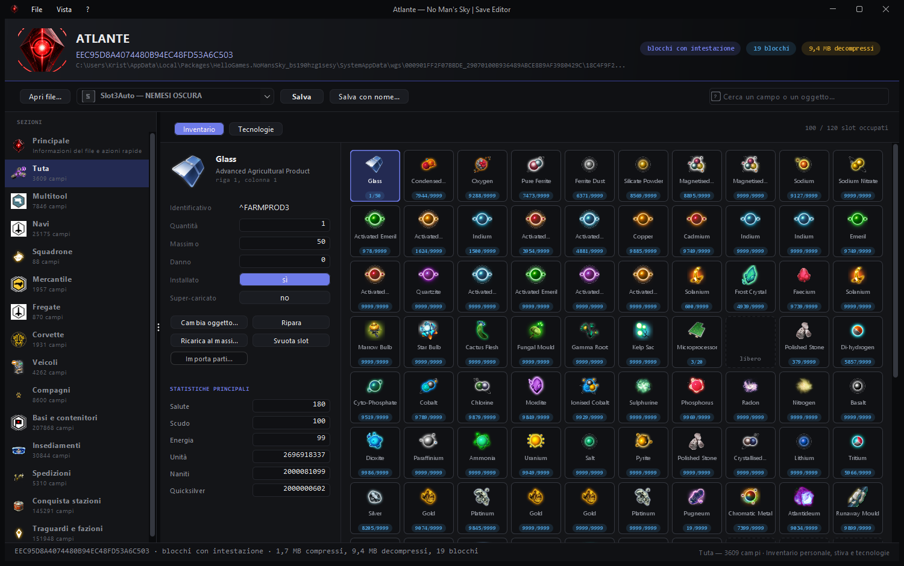
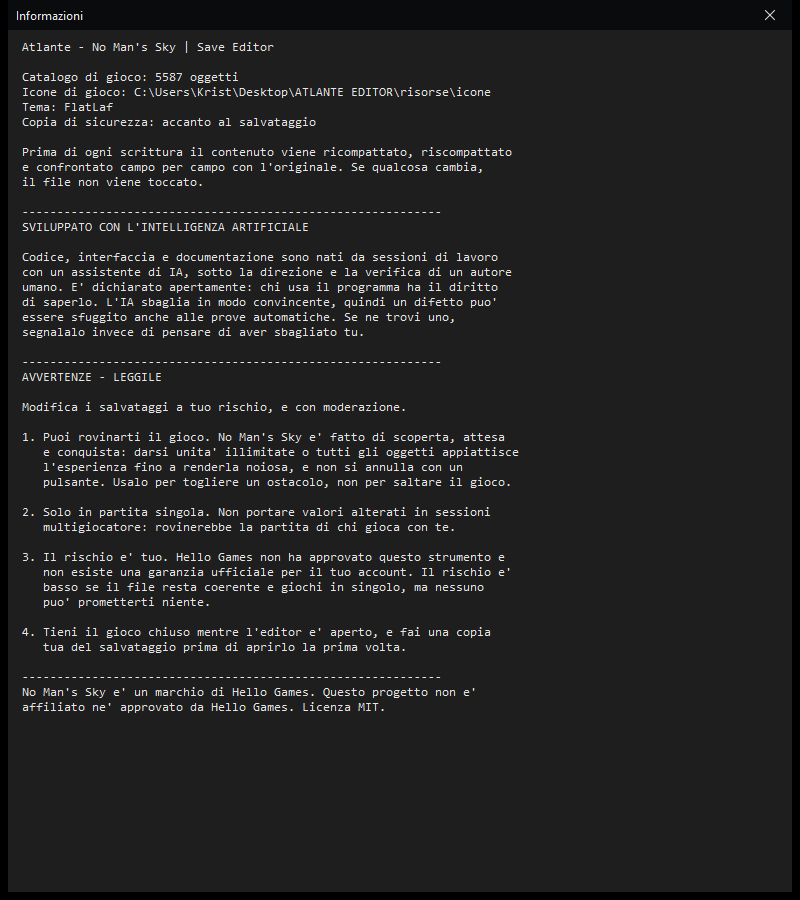

<p align="center">
  
</p>

<h1 align="center">Atlante</h1>

<p align="center">
  <strong>No Man's Sky | Save Editor</strong><br>
  Scritto da zero in Java, senza dipendenze esterne
</p>

<p align="center">
  <a href="LICENSE"></a>
  <a href="https://adoptium.net/"></a>
  
  
  
</p>

> [!WARNING]
> **Modifica i tuoi salvataggi a tuo rischio, e con moderazione.**
>
> Un editor di salvataggi permette di alterare dati che il gioco non si aspetta di
> vedere alterati. Tre cose da tenere a mente prima di usarlo:
>
> - **Puoi rovinarti il gioco.** No Man's Sky è fatto di scoperta, attesa e
>   conquista. Darsi duemila milioni di unità, una nave al massimo o tutti gli
>   oggetti appiattisce l'esperienza fino a renderla noiosa, e quello non si
>   annulla con un pulsante. Usane poco, e per togliere un ostacolo — non per
>   saltare il gioco.
> - **Il gioco in multigiocatore è un'altra cosa.** Questo editor è per la partita
>   **in singolo**. Non usarlo per portare valori alterati in sessioni con altri
>   giocatori: rovinerebbe la loro partita e non è un comportamento corretto.
> - **Hello Games non ha approvato questo strumento.** Non esiste una garanzia
>   ufficiale che l'uso di un editor di salvataggi non comporti conseguenze sul
>   tuo account. Il rischio è piccolo se il file resta coerente e lo usi in
>   singolo, ma **è tuo**: valuta tu se vale la pena.
>
> Un consiglio pratico che vale più di tutti gli altri: **fai una copia del tuo
> salvataggio prima di aprirlo la prima volta**, e tieni il gioco chiuso mentre
> l'editor è aperto. L'editor fa da sé una copia di sicurezza prima di ogni
> scrittura, ma una copia tua non fa mai male.

> [!NOTE]
> **Questo software è stato sviluppato con l'intelligenza artificiale.**
>
> Il codice, l'interfaccia, la documentazione e i commenti sono nati da sessioni
> di lavoro con un assistente di IA, sotto la direzione, la verifica e le
> correzioni di un autore umano. È dichiarato apertamente perché chi legge il
> codice ha il diritto di saperlo.
>
> Cosa significa in pratica, in bene e in male:
>
> - **In bene:** il progetto è stato scritto in tempi molto più brevi del solito,
>   con una copertura di prove superiore alla media — 26 prove automatiche, il
>   giro completo che confronta i dati campo per campo, e una verifica che nessuna
>   scrittura tocchi il file se il contenuto non torna identico.
> - **In male:** l'IA sbaglia, e sbaglia in modo convincente. Un difetto può
>   essersi nascosto dove le prove non arrivano. Buona parte di questo lavoro è
>   consistita proprio nel cercare e correggere errori già scritti, compreso uno
>   che su un salvataggio di spedizione mostrava i dati della partita sbagliata.
> - **Perciò:** il codice è leggibile e commentato, ma se trovi qualcosa di
>   storto **apri una segnalazione**. È il contributo più utile che puoi dare.

---

Legge i salvataggi di No Man's Sky, ne decodifica le chiavi cifrate, li mostra in un
albero con **le icone e i nomi di gioco** e li riscrive **verificando che i dati non
cambino**.

Prima di ogni scrittura il contenuto viene ricompattato, riscompattato e confrontato
campo per campo con l'originale: se anche un solo valore differisce, il file non viene
toccato.

<p align="center">
  
</p>

---

## Cosa fa

| Funzione | Stato |
|---|---|
| Lettura dei salvataggi Xbox Game Pass (WGS) | funziona |
| Lettura dei salvataggi Steam e GOG | funziona |
| Dati account (ricompense, QuickSilver) | funziona |
| Scompattazione e ricompressione LZ4 | funziona — scritta a mano |
| Decodifica delle chiavi cifrate | 640.510 su 640.567 |
| Catalogo di gioco con nomi, icone, categorie e descrizioni | 5.587 voci |
| Interfaccia grafica con tema scuro e icone di gioco | funziona |
| Ricerca fra i campi e fra gli oggetti | funziona |
| Modifica dei valori | funziona |
| Scrittura con verifica automatica e copia di sicurezza | funziona |
| Copertura dei campi del salvataggio | tutti |
| Riga di comando per script e automazioni | funziona |

**Misure sul salvataggio di prova** (Xbox Game Pass, settembre 2026): 1.743.369 byte
compressi → 9.842.314 byte decompressi, 19 blocchi, durata di gioco 185 h 58 min.

---

## Come si prova

Serve **Java 8 o superiore**. Se hai già un JDK installato (da
[Adoptium](https://adoptium.net/), o quello che trovi nel PATH) non devi fare
altro: `avvia.bat` lo cerca e lo usa.

| | |
|---|---|
| **Doppio clic su `avvia.bat`** | cerca Java, compila se serve e apre la finestra |
| **Doppio clic su `Atlante.jar`** | apre direttamente l'interfaccia, se hai già compilato |

`avvia.bat` cerca Java in questo ordine: il JDK dentro il progetto
(`strumenti\jdk8\`, se c'è), `java` nel PATH e le installazioni in
`Program Files`. Se non lo trova te lo dice invece di fallire in silenzio.

### Compilare

Serve un **JDK** (non basta il JRE: serve `javac`).

```bat
:: Windows
compila.bat
```

```bash
# Linux / macOS — serve un JDK nel PATH
./compila.sh
java -cp "classi:lib/flatlaf.jar" it.atlante.Atlante
```

Nessuna libreria da scaricare: il tema (`lib/flatlaf.jar`) è già nel progetto.

### Cosa fa all'avvio

Trova i salvataggi sulla macchina e apre il primo. Se non ne trova, usa
**File → Apri file...**.

Le icone degli oggetti e dell'interfaccia sono incluse: le trovi già in
`risorse/icone/` appena cloni, senza scaricare altro. Se le togli, il programma
funziona lo stesso mostrando gli identificatori al posto delle immagini — vedi
[NOTICE.md](NOTICE.md) per il perché di quella cartella.

### Riga di comando

```bash
java -cp "classi;lib/flatlaf.jar" it.atlante.Main elenca "<cartella WGS>"
java -cp "classi;lib/flatlaf.jar" it.atlante.Main info   <file>
java -cp "classi;lib/flatlaf.jar" it.atlante.Main dump   <file> uscita.json
java -cp "classi;lib/flatlaf.jar" it.atlante.Main giro   <file>
```

| Comando | Cosa fa |
|---|---|
| `elenca <cartella>` | elenca gli slot trovati, con nome, durata di gioco e dimensioni |
| `info <file>` | riassunto: blocchi, rapporto, chiavi riconosciute, campi di primo livello |
| `dump <file> [uscita]` | scrive il salvataggio in JSON con i nomi dei campi leggibili |
| `giro <file>` | **il collaudo che conta**: legge, riscrive, rilegge e verifica che i dati coincidano |

### Il collaudo completo

`giro` lavora tutto in memoria e non tocca mai il disco. Lo strumento
`Collaudo` copre le parti che invece ci scrivono: apre il file, lo salva,
controlla la copia di sicurezza, modifica un valore e verifica che sopravviva,
poi prova i casi storti (un file qualunque, un file vuoto, una cartella, un
file che non esiste) per accertarsi che diano un errore e non un arresto.

L'ultima prova riguarda il **contesto attivo**. Un salvataggio tiene due copie
dello stato del giocatore — la partita e la spedizione — e `ActiveContext` dice
quale delle due è in corso. La prova mette il contesto a spedizione, in
memoria, e controlla che il percorso di ogni scheda segua quel ramo: se una
scheda restasse attaccata alla partita principale, in spedizione si vedrebbero
i nomi di una partita con dentro gli oggetti dell'altra.

Lavora su una copia, in una cartella a parte: **il salvataggio vero non viene
mai toccato.** Esce con codice 1 se una prova fallisce, quindi si può usare in
una catena automatica. Si può rilanciare quante volte si vuole: la copia di
lavoro viene rifatta da capo ogni volta.

```bash
java -cp "classi;lib/flatlaf.jar" it.atlante.strumenti.Collaudo <file> [cartella]
```

### Dove sono i salvataggi

| Piattaforma | Percorso |
|---|---|
| Steam / GOG | `%USERPROFILE%\AppData\Roaming\HelloGames\NMS\` |
| Xbox Game Pass | `%LOCALAPPDATA%\Packages\HelloGames.NoMansSky_bs190hzg1sesy\SystemAppData\wgs\` |

---

## Il formato dei salvataggi

Documentazione verificata sui byte, non ricavata da supposizioni. Serve anche a chi
vuole scrivere un editor per conto proprio.

### 1. I due formati

No Man's Sky scrive i dati in due modi diversi, e vanno riconosciuti dal **contenuto**,
perché nulla nel nome del file li distingue:

| Formato | Dove | Com'è fatto |
|---|---|---|
| **Blocchi** | salvataggi principali | sequenza di blocchi, ognuno con intestazione di 16 byte e un blocco LZ4 |
| **LZ4 grezzo** | dati account | un solo blocco LZ4 senza intestazione |

### 2. Il flusso a blocchi

```
ripetuto fino a fine file:
  magic             4 byte    E5 A1 ED FE
  dimensioneComp    4 byte    uint32 little endian
  dimensioneDecomp  4 byte    uint32 little endian   (524288 = 512 KB)
  riservato         4 byte    sempre zero
  dati              dimensioneComp byte, blocco LZ4 grezzo
```

Non c'è intestazione di file: il primo blocco comincia subito. La dimensione decompressa
è sempre 524.288 byte, tranne nell'ultimo blocco.

### 3. Il contenitore Xbox Game Pass

```
<radice>/containers.index                   elenco dei contenitori
<radice>/<GUID 32 caratteri>/container.NN   descrittore, contiene il nome "data"
<radice>/<GUID>/<GUID>                      payload: flusso a blocchi
<radice>/<GUID>/<GUID>                      metadati: durata, nome del salvataggio
```

I due file con nome a GUID si distinguono dal contenuto, non dal nome: il payload
comincia con il magic del flusso a blocchi, i metadati con un'intestazione di 20 byte.

Il suffisso di `container.NN` **non è fisso**: il gioco lo incrementa (`container.23`,
`container.27`, `container.31`). Va sempre cercato il più recente presente su disco.

### 4. `containers.index`

Serializzazione .NET. Ogni stringa è preceduta da un `uint32` con il numero di
caratteri, seguita da UTF-16LE. Ogni voce ha questa forma:

```
<nome slot>   <identificativo fra virgolette>   <GUID binario di 16 byte>
```

Il nome dello slot **precede** il GUID, che compare in forma binaria con i primi tre
campi invertiti (ordine .NET). Verificato: nell'indice compare prima il contenitore
dei dati account, poi i due slot di salvataggio (Automatico e Manuale), nell'ordine
in cui sono elencati.

### 5. I metadati

```
0   uint32   costante 4225 nei salvataggi di prova
4   uint32   costante 1
8   uint32   durata di gioco in secondi
12  uint32   zero
16  uint32   dimensione del payload decompresso
20  ...      nome del salvataggio, testo a terminazione nulla
```

### 6. Le chiavi cifrate

Il gioco non scrive i nomi dei campi. Scrive terne di tre caratteri prodotte da un hash
del nome: `{"F2P":4737}` invece di `{"Version":4737}`.

La corrispondenza fra terna e nome è **un dato, non un algoritmo**: le terne sono
calcolabili, i nomi si scoprono leggendo i salvataggi. `risorse/db/jsonmap.txt` contiene
quell'elenco, una voce per riga nel formato `terna<TAB>NomeProprieta`.

Le 57 chiavi ancora ignote sono proprietà introdotte da aggiornamenti recenti del gioco.
Restano visibili con la loro terna invece di essere perse.

---

## Architettura

```
src/it/atlante/
  Atlante.java              avvio dell'interfaccia
  Main.java                 riga di comando
  io/
    Lz4.java                compressione LZ4, scritta a mano
    FlussoBlocchi.java      il flusso a blocchi con magic e intestazioni
  json/
    Json.java               lettore e scrittore JSON
  nms/
    Formato.java            riconoscimento dei due formati
    Catalogo.java           catalogo di gioco: nomi, icone, descrizioni
    MappaChiavi.java        mappa terna <-> nome proprieta'
    ContenitoreWgs.java     contenitori Xbox Game Pass
    Rilevatore.java         ricerca dei salvataggi sulla macchina
    Salvataggio.java        il salvataggio aperto, con verifica e scrittura
  finestra/
    Aspetto.java            tema FlatLaf con la tavolozza del marchio
    Marchio.java            icona dell'applicazione
    Icone.java              icone di gioco, con memoria
    AlberoDati.java         albero dei campi, con icone e modifica
    PannelloDettagli.java   scheda dell'oggetto e modifica dei valori
    Finestra.java           finestra principale
  strumenti/
    Schermate.java          genera le schermate della documentazione
    Collaudo.java           prova lettura e scrittura su una copia del file
lib/
  flatlaf.jar               tema dell'interfaccia (Apache 2.0)
risorse/
  db/                       catalogo, mappe delle chiavi, database di gioco
  icone/                    icone degli oggetti
```

### Quattro decisioni che vale la pena spiegare

**I numeri non passano per la virgola mobile.** Un campo come `0.6000000238418579`
letto come `double` e riscritto diventa `0.6`, e il gioco riceve un valore diverso da
quello che aveva scritto. Un identificatore intero grande supera i 53 bit e viene
arrotondato in silenzio. Ogni numero conserva il testo originale.

**L'ordine dei campi viene conservato.** Un JSON con le chiavi in ordine diverso resta
valido, ma rende impossibile il confronto durante il collaudo.

**La verifica viene prima della scrittura, non dopo.** Non c'è un "sei sicuro?" da
cliccare: se il contenuto non sopravvive al giro completo, il programma si ferma. Una
copia di sicurezza con data e ora viene comunque creata, e la sostituzione è atomica.

**Il catalogo è separato dal salvataggio.** Il salvataggio contiene sigle; il catalogo
sa che `^AF_METAL` è "Tainted Metal", che è un rottame recuperato, e qual è la sua
descrizione. Tenendoli separati, un aggiornamento del gioco si gestisce aggiornando un
file di dati, senza toccare una riga di codice.

---

## Perché è scritto da zero

Esiste già un editor di salvataggi per No Man's Sky, molto diffuso, e non dichiara alcuna
licenza. Modificarlo o ridistribuirlo significherebbe usare codice altrui senza permesso.

Questo progetto non contiene codice di terzi: legge un formato di file, e i formati non
sono protetti dal diritto d'autore. L'unica libreria inclusa è FlatLaf (Apache 2.0), il
tema dell'interfaccia, con la sua licenza.

---

## Avvertenze

Le stesse cose scritte in cima, spiegate meglio — perché sono le uniche che
potrebbero costarti qualcosa.

### Non rovinarti il gioco

Un editor di salvataggi è uno strumento potente, e la potenza va dosata. I due
errori classici:

- **Riempire tutto subito.** Unità illimitate, la nave al massimo, ogni oggetto
  nello zaino. Sembra bello per un pomeriggio, poi il gioco non ha più niente da
  darti: le missioni perdono senso, le risorse non servono, le navi non
  incuriosiscono. Il divertimento di No Man's Sky sta nell'attesa, e l'attesa
  cancellata non si ricostruisce.
- **Saltare i passaggi che insegnano.** Il gioco spiega le meccaniche attraverso
  la fatica: riparare, cercare, sopravvivere. Chi salta quella parte si ritrova
  con un gioco che non capisce, e con la sensazione di essersi perso qualcosa.

Il modo sano di usarlo è un altro: **togliere un ostacolo che ti blocca.** Sei
bloccato in una grotta per un bug, hai perso una nave per un difetto del gioco,
vuoi solo correggere un valore sballato. Va benissimo. Se invece lo apri per
"diventare forte", stai togliendo valore alla tua stessa partita.

### Sì, e il multigiocatore?

Questa è la parte seria. **L'editor è pensato per la partita in singolo.**

No Man's Sky ha un multigiocatore condiviso: se porti una partita alterata in una
sessione con altre persone, porti con te valori che loro non hanno. Può
sembrare generoso regalare unità a tutti, ma rovinare la partita di qualcun
altro non è una cosa che si fa — e le regole di condotta di Hello Games non
prevedono eccezioni per le buone intenzioni. **Non usare l'editor per giocare
con altri.**

### Il rischio del ban

Va detto con onestà, senza allarmismo e senza false rassicurazioni:

- **Questo non è uno strumento approvato da Hello Games.** Il gioco non prevede
  un editor di salvataggi ufficiale, e nessuno può garantirti che l'uso di uno
  strumento esterno sia privo di conseguenze.
- **Il rischio, in pratica, è basso** se il file resta **coerente** con quello
  che il gioco sa leggere e se giochi per conto tuo. Hello Games non ha mai
  annunciato una caccia a chi modifica i salvataggi in singolo, e i valori che
  questo editor scrive rispettano i tipi e le caselle che il gioco si aspetta.
- **Il rischio cresce con le cose assurde**: valori fuori dai limiti previsti,
  oggetti che non dovrebbero esistere, dati incoerenti fra loro. Sono proprio le
  situazioni in cui il gioco può accorgersi che qualcosa non torna.
- **La decisione è tua.** Nessuno qui può prometterti niente. La scrivo perché
  tu possa valutarla con le informazioni in mano, non per spaventarti.

Se vuoi ridurre il rischio al minimo: usa l'editor **a gioco chiuso**, cambia il
meno possibile, e **tieni una copia tua del salvataggio** prima di iniziare.

### Sugli sviluppatori di IA

Il progetto è stato scritto con l'aiuto di un assistente di intelligenza
artificiale, e questo è dichiarato apertamente in cima al file. Non è una
formalità: serve a dirti che **i difetti possono esserci**, anche in un progetto
con molte prove automatiche, perché l'IA sbaglia in modo convincente e non si
stanca mai di avere torto.

Se qualcosa non funziona — un salvataggio che non si legge, un valore che cambia
dopo il salvataggio, una sezione che mostra dati che non c'entrano — **non
pensare di aver sbagliato tu**: quasi sempre è un difetto, e si corregge in
fretta. Apri una segnalazione.

### Dove sta scritto, dentro il programma

La dichiarazione e le avvertenze non stanno solo qui: sono anche nella finestra
**Informazioni** del programma, perché chi lo apre può non aver mai visto questo
repository, e quelle sono proprio le cose da sapere prima di toccare il
salvataggio. Il testo è lo stesso metodo, non una copia — se cambia nel
programma, cambia anche nell'immagine qui sotto.

<p align="center">
  
</p>

---

## Come contribuire

Il contributo più utile è **segnalare una discrepanza**: un salvataggio che non si legge,
un valore che cambia dopo il giro completo, una chiave ignota di cui conosci il nome.

Il comando `giro` è lo strumento con cui verificare qualsiasi modifica alla lettura o
alla scrittura: **se non passa, la modifica è sbagliata.**

---

## Licenza

Codice rilasciato con licenza **MIT** — vedi [LICENSE](LICENSE).
Le librerie incluse, i dati di gioco e i marchi sono documentati in [NOTICE.md](NOTICE.md).

No Man's Sky e tutti i nomi correlati sono marchi di Hello Games Limited.
Questo progetto non è affiliato, approvato o sponsorizzato da Hello Games.
